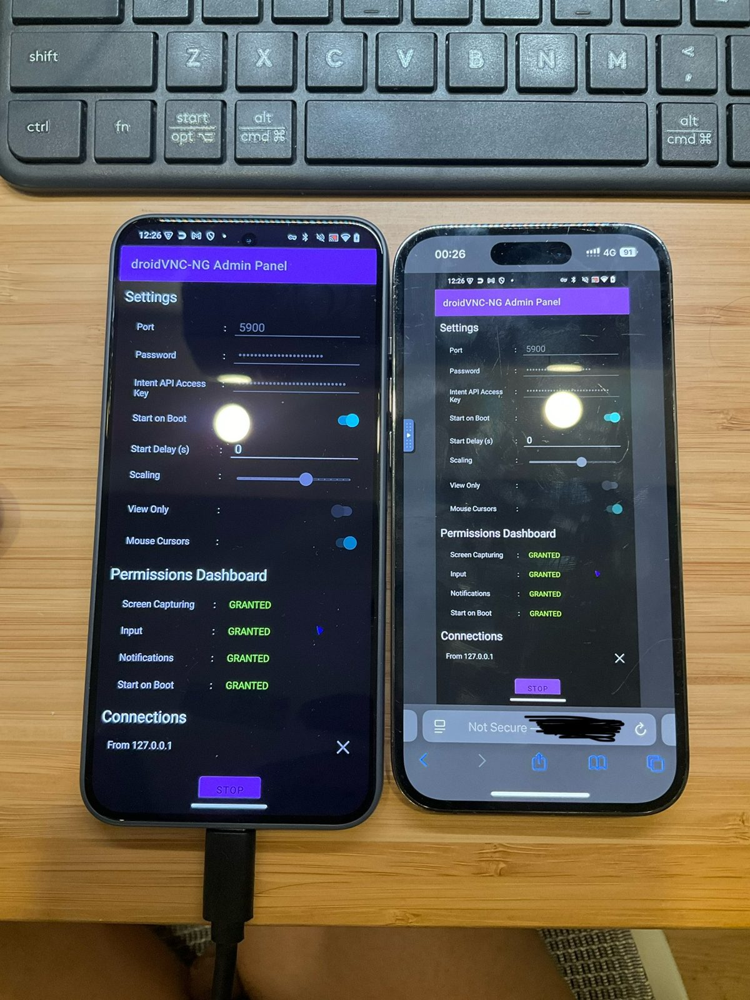

# Android Remote Browser

**极其推荐：用数据线连接安卓手机，开启 USB Debugging，然后直接让 AI Agent 根据本教程完成配置、检查与日常恢复操作。** 这样最省心，也最适合不熟悉 ADB、Tailscale、VNC/noVNC 的用户。

> English version: [`README.en.md`](README.en.md)

<p align="center">
  <a href="LICENSE"></a>
  
  
  
</p>

Android Remote Browser 是一套让 **iPhone Safari 通过 Tailscale 私有网络远程控制自有 Android 手机** 的开源工具与教程。它把 `droidVNC-NG`、`noVNC` 和一个很小的 Go WebSocket 代理串起来，让安卓手机自己提供网页远控入口。

```text
iPhone Safari
  -> Tailscale 私有网络
  -> Android <ANDROID_TAILSCALE_IP>:6080
  -> android-novnc-proxy /websockify
  -> droidVNC-NG 127.0.0.1:5900
  -> Android 画面与触控输入
```

最终访问地址形如：

```text
http://<ANDROID_TAILSCALE_IP>:6080/vnc.html?host=<ANDROID_TAILSCALE_IP>&port=6080&path=websockify&encrypt=0&autoconnect=true
```

> **使用边界**：仅用于你拥有或被明确授权管理的设备，例如测试、维护、辅助操作、演示和自用远程管理。不要用于虚假定位、虚假到岗、绕过单位/应用规则或任何未授权操作。

## 效果演示

下面是配置成功后的实际效果：左侧 Android 运行 `droidVNC-NG`，右侧 iPhone Safari 通过 noVNC 看到同一台 Android，并可以远程点击/滑动。

<p align="center">
  
</p>

## 这个项目解决什么问题

从 iPhone 远程控制 Android 听起来简单，但实际会碰到几个坑：

- iOS 上的 VNC 客户端不一定能稳定连接 Android VNC 服务；
- droidVNC-NG 自带网页入口在某些环境下不够适配 Safari/noVNC；
- 直接把 VNC 或 ADB 暴露到公网非常危险；
- Android 的屏幕采集权限可能在锁屏、休眠、重启或进程被杀后失效；
- 普通用户很容易卡在 ADB、Tailscale、端口、权限、noVNC 参数这些细节上。

本项目提供一条已经实测走通的路线：

- 用 **Tailscale** 建立私有网络；
- 用 **droidVNC-NG** 在 Android 上提供 VNC 服务；
- 用 **android-novnc-proxy** 在 Android 上提供 Safari 可访问的 noVNC 页面；
- 用脚本完成安装、配置、检查、省电常驻和故障恢复。

## 准备条件

| 位置 | 需要准备 |
| --- | --- |
| Android | droidVNC-NG、Tailscale、USB Debugging 初始授权 |
| iPhone | Tailscale、Safari |
| Mac / Linux 配置机 | `adb`、`python3`、`go`、一根能传数据的 USB 线 |

日常从 iPhone 控制 Android 时，配置机不需要一直在线；它主要用于初始安装、配置和必要时恢复服务。

## 快速开始

完整中文步骤见：[`QUICKSTART.zh-CN.md`](QUICKSTART.zh-CN.md)。

最短流程如下：

```bash
# 1. 安装 droidVNC-NG 到已授权 USB Debugging 的 Android 设备
./scripts/install_droidvnc_ng.sh --serial <ANDROID_SERIAL>

# 2. 配置并启动 Android 上的 VNC 服务，端口 5900
./scripts/configure_droidvnc.sh \
  --serial <ANDROID_SERIAL> \
  --port 5900 \
  --scaling 0.6 \
  --start-on-boot

# 3. 编译/部署/启动 Android 上的 noVNC 代理，端口 6080
./scripts/start_android_novnc_proxy.sh --serial <ANDROID_SERIAL>

# 4. 配置省电常驻：允许屏幕 60 秒后熄灭，同时尽量保活 Tailscale/droidVNC
./scripts/configure_battery_friendly_persistence.sh \
  --serial <ANDROID_SERIAL> \
  --screen-timeout 60000
```

`start_android_novnc_proxy.sh` 会自动打印 iPhone Safari 应该打开的 URL。

## 免手输 VNC 密码

noVNC 支持把 VNC 密码放进 URL 参数。确认连接成功后，可以把下面这种链接保存成 iPhone Safari 书签：

```text
http://<ANDROID_TAILSCALE_IP>:6080/vnc.html?host=<ANDROID_TAILSCALE_IP>&port=6080&path=websockify&encrypt=0&autoconnect=true&password=<VNC_PASSWORD>
```

这样打开书签后通常会自动连接，不需要每次手动输入 VNC 密码。

注意：

- 这个链接等同于包含密码，不要截图、公开分享或提交到仓库；
- 只建议保存在你自己的 iPhone / 私有密码管理器 / 私有备忘录里；
- 如果这个链接泄露，立刻轮换 VNC 密码：

```bash
./scripts/configure_droidvnc.sh \
  --serial <ANDROID_SERIAL> \
  --port 5900 \
  --scaling 0.6 \
  --rotate-credentials
```

## 日常恢复

如果隔夜后出现以下情况：

- Safari 页面能打开但 Connect 失败；
- 可以远程点击，但画面不刷新；
- 画面停在锁屏或旧画面；
- noVNC 代理被系统杀掉；

有 ADB/配置机时，直接运行：

```bash
./scripts/recover_droidvnc_session.sh --serial <ANDROID_SERIAL> --port 5900
```

没有配置机时，在 Android 本机手动恢复：

1. 打开 Tailscale，确认状态是 `Connected`；
2. 打开 droidVNC-NG；
3. 确认 `Input = GRANTED`；
4. 如果 `Screen Capturing = DENIED`，点 `START`；
5. 系统弹出屏幕采集授权时点允许；
6. 确认按钮变成 `STOP`，这代表服务正在运行；
7. 回到 iPhone Safari 重新打开 noVNC 链接。

详见：[`RUNBOOK.zh-CN.md`](RUNBOOK.zh-CN.md) 和 [`docs/troubleshooting.md`](docs/troubleshooting.md)。

## 必须知道的限制

Android 的屏幕采集由系统 `MediaProjection` 权限控制。对于非 root、非设备所有者模式的普通手机，这个权限在重启、深度休眠、进程被杀或某些厂商省电策略触发后，可能需要用户再次确认。

也就是说，本项目可以尽量让 Tailscale 和 droidVNC-NG 常驻，但不能保证所有 Android 机型都能永久无人值守地保持 `Screen Capturing = GRANTED`。

## 项目结构

| 路径 | 说明 |
| --- | --- |
| `scripts/` | 安装、配置、恢复、检查、省电常驻脚本 |
| `tools/android-novnc-proxy/` | Go 写的 WebSocket-to-VNC 代理源码 |
| `docs/` | 架构、排障、开发说明和演示图 |
| `QUICKSTART.zh-CN.md` | 最短中文启动流程 |
| `GUIDE.zh-CN.md` | 完整中文实施指南 |
| `RUNBOOK.zh-CN.md` | 日常运维手册 |
| `README.en.md` | 英文 README |
| `FILES.md` | 文件清单 |
| `ACCEPTANCE.md` | 验收清单 |

## 核心脚本

- `scripts/install_droidvnc_ng.sh`：通过 ADB 安装 droidVNC-NG。
- `scripts/configure_droidvnc.sh`：写入 droidVNC 配置、密码、端口和缩放，并启动 VNC 服务。
- `scripts/start_android_novnc_proxy.sh`：编译/部署/启动 Android 上的 noVNC WebSocket 代理。
- `scripts/configure_battery_friendly_persistence.sh`：允许屏幕熄灭，同时尽量放开 Tailscale/droidVNC 的后台限制。
- `scripts/recover_droidvnc_session.sh`：隔夜、画面冻结、屏幕采集权限丢失或代理异常时恢复。
- `scripts/check_android_tailscale.sh` / `scripts/check_droidvnc.sh`：检查运行状态。

## 安全说明

不要提交或公开：

- `.droidvnc.env`
- `.secrets/`
- `downloads/`
- `.omx/`
- 生成的二进制文件 `tools/android-novnc-proxy/android-novnc-proxy`

这些都已经被 `.gitignore` 忽略。公开模板见：[`examples/droidvnc.env.example`](examples/droidvnc.env.example)。

不要把 ADB `5555`、VNC `5900` 或 noVNC `6080` 直接暴露到公网。请使用 Tailscale/ZeroTier 这类私有网络，并定期轮换 VNC 密码。

## 参与贡献

欢迎改进文档、兼容性、恢复流程和不同 Android 机型的经验。贡献前请看：[`CONTRIBUTING.md`](CONTRIBUTING.md) 与 [`docs/development.md`](docs/development.md)。

## License

MIT. See [`LICENSE`](LICENSE).
